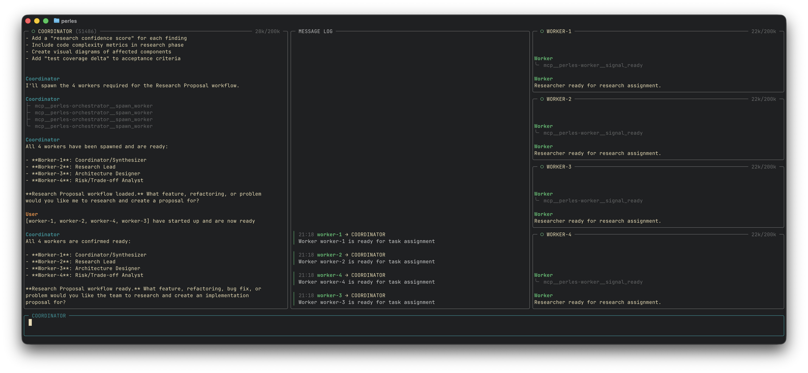
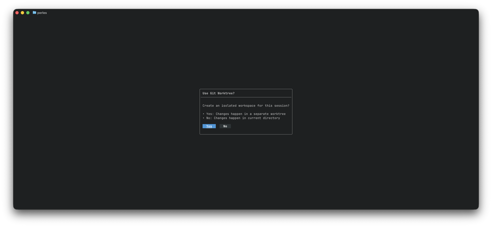
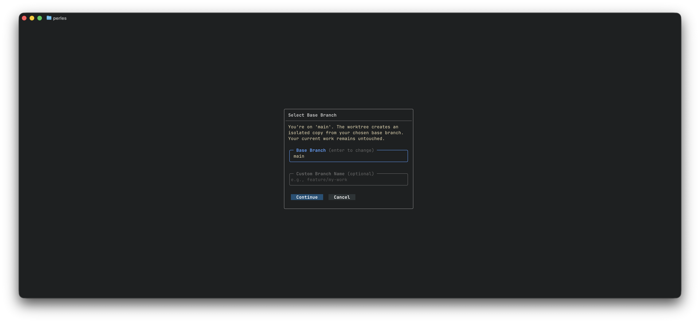
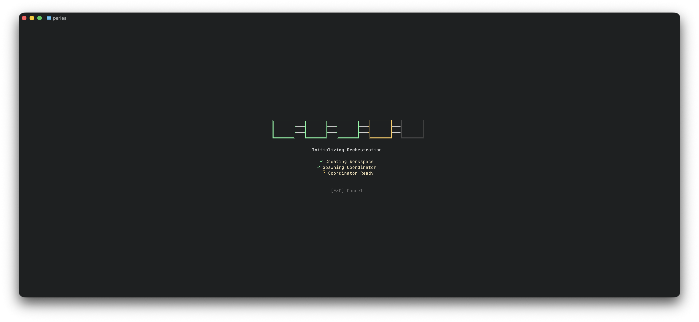
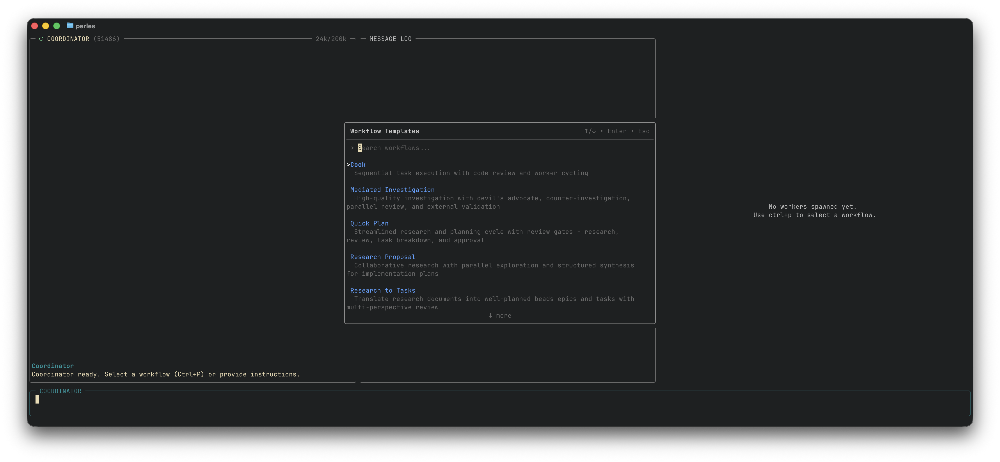

# Orchestration Mode

> **WARNING** Orchestration mode is not cheap it spawns multiple headless AI agents to plan, investigate, and execute tasks.
> If you care about money do not use orchestration mode.

Orchestration mode is a multi-agent workspace where a single coordinator agent handles spawning, replacing and retiring other headless agents through
built-in MCP tools. The coordinator agent delegates sub-tasks to multiple worker agents so you don't have to manually stop and start sessions on your own. 
This allows for structured workflow instructions that can manage and orchestrate multiple headless AI agents.

- **Coordinator** A single headless agent that receives workflow instructions and manages the session.
- **Workers** Multiple headless agents who execute specific sub-tasks (coding, testing, reviewing, documenting)

<p align="center">
  
</p>

---

## Getting Started

### Configuration

The default orchestration settings use Claude Code with Opus 4.5 and currently works the best. 
You can customize these settings in your `~/.config/xorchestrator/config.yaml` but they are optional:

```yaml
orchestration:
  client: "claude"              # Options: claude, amp, codex
  disable_worktrees: false      # Set true to skip git worktree isolation
  
  # Provider-specific settings
  claude:
    model: "opus"               # Options: sonnet, opus, haiku
  amp:
    model: "opus"               # Options: opus, sonnet
    mode: "smart"               # Options: free, rush, smart
  codex:
    model: "gpt-5.2-codex"      # Options: gpt-5.2-codex, o4-mini
```

### Quick Start

1. Open Xorchestrator in your project directory.
2. Press `ctrl+o` to enter orchestration mode.
3. Choose if you want to use a git worktree for the session.
4. Press `ctrl+p` to open the workflow picker once orchestration mode is loaded.
5. Select a workflow template 
   - A typical workflow is done over multiple sessions. You would start with the  **Research Proposal** to generate a proposal document. You would then exist and start a new session using the **Research to Tasks** to break down the proposal document into beads epics and tasks. Then you would quite and start a new session using the **Cook** workflow to work through the entire epic's tasks.
6. The coordinator will follow the workflow instructions and ask you for confirmation before starting.

---

Everytime orchestration mode is entered you will be asked if you want to create a git worktree.
If you don't want to use worktree you can disable this prompt in your config by setting `disable_worktrees: true` under the `orchestration` section.
 
<p align="center">
  
</p>

When using a worktree you can specify a different base branch to create the worktree from along with an optional branch name. If you are just doing research or converting a research proposal into an epic and tasks you likely do not have to use a worktree since you are not changing any code. Worktree's are primarily meant for when you are running multiple "Cook" workflows on different epics in parallel.

<p align="center">
  
</p>

The orchestrator will start up spawning the coordinator agent

<p align="center">
  
</p>

Orchestration mode is primarily meant to be used with the built-in workflows, when orchestration mode is started use `ctrl+p` to open the workflow picker and select a workflow template to get started.

<p align="center">
  
</p>

---

## 3-Pane Layout

Orchestration mode displays three main panes plus a chat input:

<p align="center">
  
</p>

### Coordinator Pane

A headless AI agent process that plans and delegates work to the workers based on workflow instructions.

**What you see:**
- Status indicator showing coordinator state
- Token usage metrics (context consumption)
- Queue count when messages are pending
- Full conversation history

**Status indicators:**
| Icon | Meaning |
|------|---------|
| `●` (blue) | Working — actively processing |
| `○` (green) | Ready — waiting for input |
| `⏸` | Paused — workflow paused |
| `⚠` (yellow) | Stopped — needs attention |
| `✗` (red) | Failed — error occurred |

### Message Log

The timeline of all inter-agent communication. Workers post to the message log when they finish their turns which nudges the coordinator to read and act.
Workers are automatically enforced to end their turn with an MCP tool call to post their message to the log, if they do not use a tool call the system will
intercept and remind them to do so.

**What you see:**
- Timestamps for each message
- Sender → Recipient labels

### Worker Pane

Stacked view of active individual AI agent processes and their chat outputs.

**What you see for each worker:**
- Worker ID and name (e.g., `WORKER-1 xorchestrator-abc.1`)
- Current phase: `(impl)`, `(review)`, `(commit)`, etc.
- Status indicator (same icons as coordinator)
- Token/cost metrics
- Output content

**Worker phases:**

When using the Cook workflow template workers have additional phases to indicate their current activity:

| Phase | Meaning |
|-------|---------|
| `idle` | Waiting for assignment |
| `impl` | Implementing a task |
| `review` | Reviewing work |
| `await` | Awaiting feedback |
| `feedback` | Addressing feedback |
| `commit` | Committing changes |

### Chat Input Bar

Text input area for sending messages to the coordinator or workers. 

**Visual feedback:**
- Border color indicates your message target:
  - **Teal** = Sending to coordinator
  - **Green** = Sending to a specific worker
  - **Orange** = Broadcasting to all
- WHen vim_mode is enabled shows which vim mode you are in for the text input.

---

## Workflow Templates

Workflow templates are pre-defined "recipes" for common orchestration patterns they are simply prompts to the coordinator but designed to utilize the fact the coordinator has access to MCP tools to manage multiple workers.

### Built-in Templates

| Template | Description |
|----------|-------------|
| **Cook** | Sequential task execution with code review |
| **Quick Plan** | Rapid planning and task breakdown |
| **Research to Tasks** | Research a topic and convert findings to actionable tasks |
| **Debate** | Multi-agent debate for exploring solutions |
| **Mediated Investigation** | Structured investigation with mediator |
| **Research Proposal** | Collaborative proposal development |

### Using the Workflow Picker

1. Press `ctrl+p` to open the command palette
2. Browse or search available templates
3. Select a template with `Enter`

**Template colors in the picker:**
- **Blue** = Built-in templates
- **Green** = User-defined templates

<p align="center">
  
</p>

### Creating Custom Templates

Create your own templates in `~/.xorchestrator/workflows/` and they will be loaded into the picker automatically.

The `target_mode` determines if the workflow will be shown in `orchestration` mode or `chat` mode. 

```yaml
---
name: "My Custom Workflow"
description: "Description shown in picker"
category: "Work"
workers: 2
target_mode: "orchestration"
agent_roles:
  implementer:
    system_prompt_append: "Focus on clean, tested code..."
  reviewer:
    system_prompt_append: "Be thorough in code review..."
---

# Workflow Instructions

Your markdown instructions for the coordinator go here.
Explain what this workflow does and how to approach the task.
```

---

## Keybindings & Controls

### Primary Controls

| Key              | Action                                       |
|------------------|----------------------------------------------|
| `ctrl+o`         | Enter orchestration mode (from kanban) |
| `ctrl+p`         | Open workflow template picker                |
| `ctrl+r`         | Replace coordinator with fresh process       |
| `ctrl+f`         | Toggle navigation mode (fullscreen panes)    |
| `ctrl+c` / `esc` | Quit (shows confirmation)                    |

### Messaging

| Key | Action |
|-----|--------|
| `Tab` | Cycle message target: Coordinator → Broadcast → Workers |
| `Enter` | Send message to current target |
| `Shift+Enter` | Send message (alternative) |

### Navigation Mode

Press `ctrl+f` to enter navigation mode, then:

| Key | Action |
|-----|--------|
| `1-4` | Fullscreen worker pane 1-4 |
| `5` | Fullscreen coordinator pane |
| `6` | Fullscreen message log |
| `7` | Fullscreen command pane |
| `Esc` | Exit navigation mode |

### Slash Commands

Slash commands let you control workers directly to stop, retire, or replace them.

| Command                | Action |
|------------------------|--------|
| `/stop <worker-id>`    | Gracefully retire a worker |
| `/retire <worker-id>`  | Gracefully retire a worker |
| `/replace <worker-id>` | Replace a worker with a fresh one |

---

## Session Management

### Session Storage

Every orchestration session data is stored centrally in your home directory `~/.xorchestrator/sessions/`

```
~/.xorchestrator/sessions/
├── sessions.json                    # Global session index
└── {project-name}/
    ├── sessions.json                # Per-project index
    └── 2026-01-12/
        └── {session-uuid}/
            ├── metadata.json
            ├── coordinator/
            ├── workers/
            └── messages.jsonl
```

### Exiting Safely

When you press `ctrl+c` or `esc`:

1. A **confirmation modal** will appear before quitting.
2. If a worktree was used and has uncommitted changes, you'll be warned, quitting while having uncommitted changes will discard them. The worktree is always removed when exiting orchestration mode.